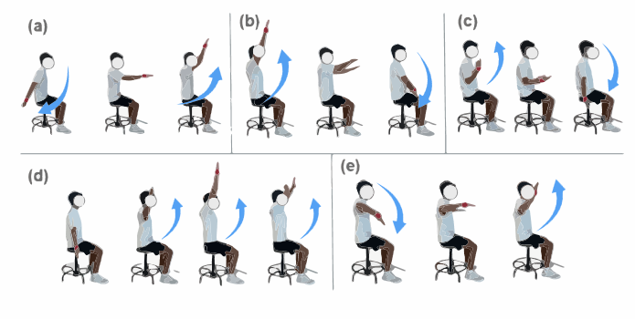

# ULTra MoCap Processing

> Scripts, notebooks, and media assets

---

## 📹 Media Gallery

### 🔍 Diagrams

|  |
|:--:|
| **Movement Diagram** — High-level schematic of task types |

---

### 🎞️ Movement Videos

| Arm Swing | Cross Body Reach | Elbow Flexion |
|-----------|------------------|----------------|
|  |  |  |

| Overhead Reach | Shoulder Rotation | |
|----------------|-------------------|--|
|  |  | |
---

## 📂 Processing Scripts

### [`batch_IK.ipynb`](processing/batch_IK.ipynb) 📊  
Performs batch processing for OpenSim inverse kinematics (IK).

- Data loading and transformation  
- IK model execution  
- Result visualization

---

### [`batch_processH5.py`](processing/batch_processH5.py) 🔄  
Combines all subject HDF5 files into a single file.

- Reads from multiple `.h5` datasets  
- Cleans and validates data  
- Merges into a unified structure

---

### [`clean_sensors.py`](processing/clean_sensors.py) 🧹  
Cleans raw sensor `.csv` files by removing unused channels.

- Removes Electromyography (sEMG)  
- Removes Magnetometer data

---

### [`movement_type_classifier.ipynb`](processing/movement_type_classifier.ipynb) 🤖  
Trains a classifier to predict movement types from time-series sensor data.

- Feature extraction  
- Model training and evaluation  
- Accuracy and confusion matrix analysis

---

### [`visualize_subject_distributions.py`](processing/visualize_subject_distributions.py) 👥  
Analyzes subject demographics.

- Height  
- Age  
- Weight

---

### [`visualize_speed_distributions.py`](processing/visualize_speed_distributions.py) 📈  
Plots joint angular speeds to analyze movement profiles.

- Speed histograms  
- Joint-specific movement trends
