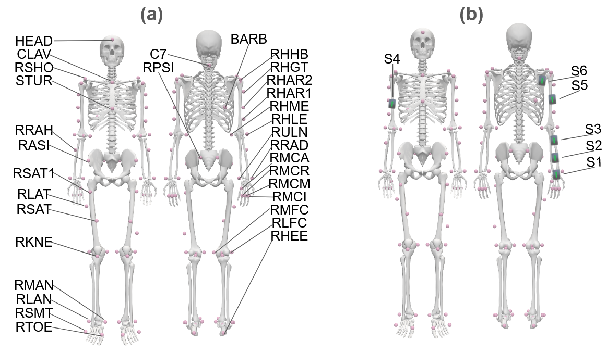

# ULTra MoCap Processing

> Scripts, notebooks, and media assets

---

## 📹 Media Gallery

### 🔍 Diagrams

  <!-- 

    
    
<strong>Marker + Sensor Layout</strong> Placement of IMUs and markers

  
 -->
  

    
    
<strong>Movement Diagram</strong> High-level schematic of task types

  

### 🎞️ Movement Videos

    

        
        <h4>Arm Swing</h4>
    

    

        
        <h4>Cross Body Reach</h4>
    

    

        
        <h4>Elbow Flexion</h4>
    

    

        
        <h4>Overhead Reach</h4>
    

    

        
        <h4>Shoulder Rotation</h4>
    

---

## 📂 Processing Scripts

  

    <h3><a href="processing/batch_IK.ipynb">batch_IK.ipynb</a> 📊</h3>
    
Performs batch processing for OpenSim inverse kinematics (IK).

    <ul>
      <li>Data loading and transformation</li>
      <li>IK model execution</li>
      <li>Result visualization</li>
    </ul>
  

  

    <h3><a href="processing/batch_processH5.py">batch_processH5.py</a> 🔄</h3>
    
Combines all subject HDF5 files into a single file.

    <ul>
      <li>Reads from multiple <code>.h5</code> datasets</li>
      <li>Cleans and validates data</li>
      <li>Merges into a unified structure</li>
    </ul>
  

  

    <h3><a href="processing/clean_sensors.py">clean_sensors.py</a> 🧹</h3>
    
Cleans raw sensor <code>.csv</code> files by removing unused channels.

    <ul>
      <li>Removes Electromyography (sEMG)</li>
      <li>Removes Magnetometer data</li>
    </ul>
  

  

    <h3><a href="processing/movement_type_classifier.ipynb">movement_type_classifier.ipynb</a> 🤖</h3>
    
Trains a classifier to predict movement types from time-series sensor data.

    <ul>
      <li>Feature extraction</li>
      <li>Model training and evaluation</li>
      <li>Accuracy and confusion matrix analysis</li>
    </ul>
  

  

    <h3><a href="processing/visualize_subject_distributions.py">visualize_subject_distributions.py</a> 👥</h3>
    
Analyzes subject demographics.

    <ul>
      <li>Height</li>
      <li>Age</li>
      <li>Weight</li>
    </ul>
  

  

    <h3><a href="processing/visualize_speed_distributions.py">visualize_speed_distributions.py</a> 📈</h3>
    
Plots joint angular speeds to analyze movement profiles.

    <ul>
      <li>Speed histograms</li>
      <li>Joint-specific movement trends</li>
    </ul>
  

